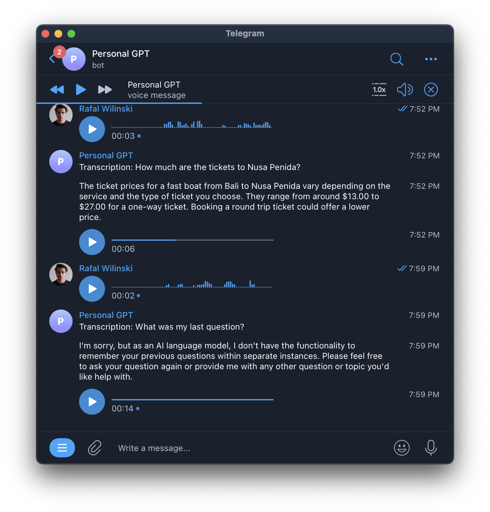

# Telegram ChatGPT Concierge Bot (+ Voice!)



This is a Telegram bot that uses:

- OpenAI's ChatGPT, obviously, as "the brain"
- [LangchainJS](https://github.com/hwchase17/langchainjs) to constructs prompts, handle convo history and interact with Google
- OpenAI's Whisper API to generate text from voice
- [Play.ht](https://play.ht) to generate voice from text and reply to voice messages

### How to use

> Prerequisite: You need to have a Telegram bot token and an OpenAI API key. Ask ChatGPT how to get these.

1. `git clone https://github.com/RafalWilinski/telegram-chatgpt-concierge-bot`
2. `cd telegram-chatgpt-concierge-bot`
3. `touch .env` and fill the following:

```
TELEGRAM_TOKEN=
OPENAI_API_KEY=
PLAY_HT_SECRET_KEY=
PLAY_HT_USER_ID=
```

4. `npm install`
5. `npm start`

--- 

Follow me on [Twitter](https://twitter.com/RafalWilinski)

Discuss on [Twitter](https://twitter.com/rafalwilinski/status/1645123663514009601) or [HackerNews](https://news.ycombinator.com/item?id=35510516)
